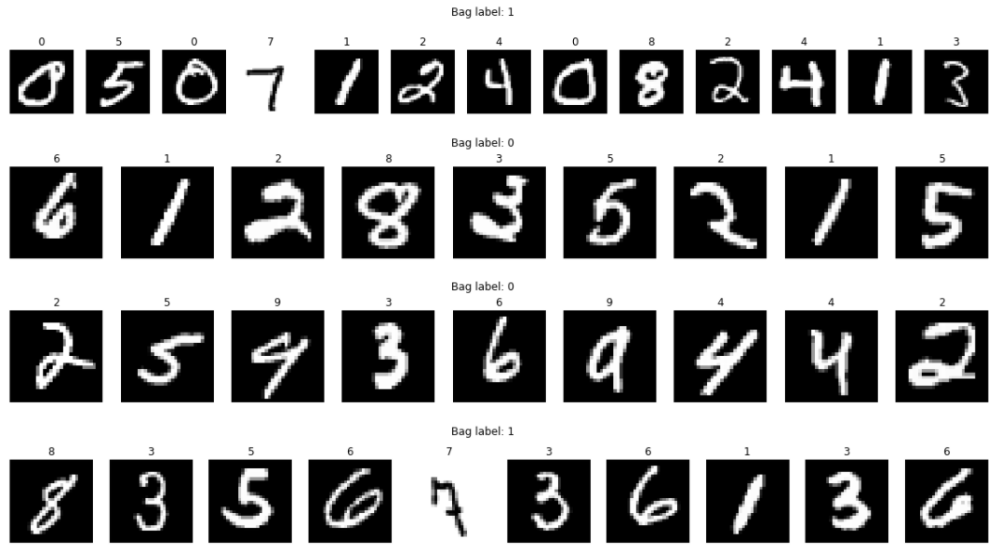
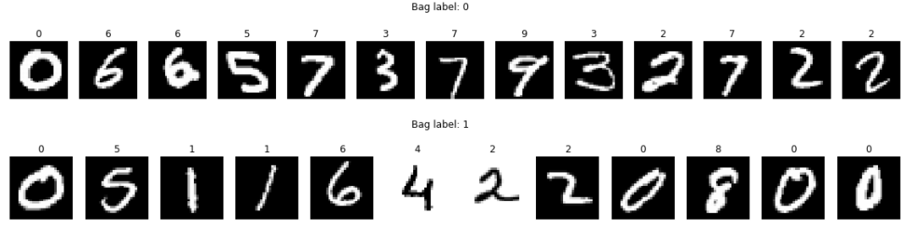

# mil: multiple instance learning library for Python

When working on a research problem, I found myself with the [multiple instance learning (MIL)](https://en.wikipedia.org/wiki/Multiple_instance_learning) framework, which I found quite interesting and unique. After carefully reviewing the literature, I decided to try few of the algorithms on the problem I was working on, but for my surprise, there was no standard, easy, and updated MIL library for any programming language. So... here we are. <br/>
The mil library tries to achieve reproducible and productive research using the MIL framework.

---

## Table of Contents

- [Installation](#installation)
- [Features](#features)
- [Usage](#usage)
- [Contributing](#contributing)
- [To-do-list](#to-do-list)
- [License](#license)

---

### Installation

Use the package manager [pip](https://pip.pypa.io/en/stable/) to install mil.

```bash
$ pip install mil
```
#### Requirements
The requirement packages for mil library are: numpy, scikit-learn, scipy, tensorflow or tensorflow-gpu.
Installing mil with the package manager does not install the package dependencies.
So install them with the package manager manually if not already downloaded.

    $ pip install numpy
    $ pip install scikit-learn
    $ pip install scipy
    $ pip install tensorflow

---

### Features

The overall implementation tries to be user-friendly as possible. That's why most of it constructed on top of [sklearn](https://scikit-learn.org/) and [tensorflow.keras](tensorflow.org/api_docs/python/tf/keras).

- [mil.data](#data)
- [mil.bag_representation](#bag_representation)
- [mil.dimensionality_reduction](#dimensionality_reduction)
- [mil.metrics](#metrics)
- [mil.models](#models)
- [mil.preprocessing](#preprocessing)
- [mil.utils](#utils)
- [mil.validators](#validators)
- [mil.trainer](#trainer)

#### data
Very well known datasets of the multiple instance learning framework have been added to the library. For each of the datasets a train and test split 
has been done for reproducibility purposes. The API is similar to the tensorflow datasets in order to create and experiment in a fast and easy way.

```python
# importing all the datasets modules
from mil.data.datasets import musk1, musk2, protein, elephant, corel_dogs, \
                              ucsb_breast_cancer, web_recommendation_1, birds_brown_creeper, \
                              mnist_bags
# load the musk1 dataset
(bags_train, y_train), (bags_test, y_test) = musk1.load()
```
Also, the mnist_bags dataset has been created. The principal reason of creating this dataset is to have a good benchmark to evaluate the instances predictions. Or more specifically, if we can classify correctly a bag, can we detect which instance/s caused this classification? 
In the mnist_bags dataset, there are 3 different types of problems with their own dataset.

1) The bag 'b' is positive if the instance '7' is contained in 'b' <br/>

```python
# importing all the datasets modules
from mil.data.datasets import mnist_bags

# load the mnist_bags
(bags_train, y_train), (bags_test, y_test) = mnist_bags.load()
```
2) The bag 'b' is positive if the instance '2' and '3' are contained in 'b'  <br/>

```python
# importing all the datasets modules
from mil.data.datasets import mnist_bags

# load the mnist_bags 2 and 3
(bags_train, y_train), (bags_test, y_test) = mnist_bags.load_2_and_3()
```
3) The bag 'b' is positive if the instance '4' and '2' are located in consecutive instances in 'b'  <br/>

```python
# importing all the datasets modules
from mil.data.datasets import mnist_bags

# load the mnist_bags 4 2
(bags_train, y_train), (bags_test, y_test) = mnist_bags.load_42()
```

#### bag_representation
In multiple instance learning, bag representation is the technique that consists in obtaining a unique vector representing all the bag.
The classes implemented in the mil.bag_representation inherit from BagRepresentation base class which is a wrapper to sklearn transformer which have to implement fit and transform method.

- MILESMapping
- DiscriminativeMapping
- ArithmeticMeanBagRepresentation
- MedianBagRepresentation
- GeometricMeanBagRepresentation
- MinBagRepresentation
- MaxBagRepresentation
- MeanMinMaxBagRepresentation

```python
from mil.bag_representation import MILESMapping, DiscriminativeMapping, ArithmeticMeanBagRepresentation, \
                                   MedianBagRepresentation, GeometricMeanBagRepresentation, MinBagRepresentation, \
                                   MaxBagRepresentation, MeanMinMaxBagRepresentation
```

---

#### dimensionality_reduction
A wrapper to sklearn.decomposition and sklearn.feature_selection.

```python
# for example import sklearn PCA
from mil.dimensionality_reduction import PCA
```

#### metrics
Includes a manager to handle all the metrics, some custom metric and a wrapper of tensorflow.keras.metrics. Custom metrics have to inherit from Metrics base class and implement methods update_state, result, and reset_states.

```python
# importing a custom metric
from mil.metrics import Specificity

# importing a keras metric
from mil.metrics import AUC
```

#### models
It contains all the end-to-end models. All the models implement a sklearn-like structure with fit, predict, and sometimes get_positive_instances when the method allows it.
- MILES
- APR
- AttentionDeepPoolingMil

```python
# importing mil models
from mil.models import APR, AttentionDeepPoolingMil, MILES

# importing sklearn models
from mil.models import RandomForestClassifier, SVC
```
It is also a wrapper to sklearn.svm, sklearn.ensemble, sklearn.linear_model, and sklearn.neighbors.

#### preprocessing
It contains few transformers to normalize and standarize bags of type list, and is also a wrapper to sklearn.preprocessing.

```python
# standarize bags of lists
from mil.preprocessing import StandarizerBagsList
```

#### utils
It contains few utility functions, such as bags2instances, padding, progress bar ...

```python
# for example importing bags2instances function
from mil.utils.utils import bags2instances
```

#### validators
A wrapper to sklearn.model_selection. Includes all the validation strategies to be used in the training process.

```python
# for example importing sklearn KFold
from mil.validators import KFold

valid = KFold(n_splits=10, shuffle=True)
```

#### trainer
It is the central part of the library, it allows to train, and evaluate models in a very simple and intuitive way.
It has 4 principal methods.

1) prepare(model, preprocess_pipeline=[], metrics=[]). <br/>
Which is kind of what 'compile' method is for keras models. What it does is preparing the training and evaluation routine.
The 'model' parameter accepts any of the mil.models objects. The 'preprocess_pipeline' parameter is a list containing all the transforming operations we wish to do before inputing the data into the 'model' object, basically accepts any sklearn transformer. The 'metrics' accepts some strings of typical metrics, or the callables modules from the metrics.<br/>

2) fit(X_train, y_train, X_val=None, y_val=None, groups=None, validation_strategy=None, sample_weights=None, verbose=1) <br/>
Which is the method to train the model. It also handles a sample_weights parameters and mil.validators objects or custom validations splits. <br/>

3) predict(X_train, y_train, X_val=None, y_val=None, groups=None, validation_strategy=None, sample_weights=None, verbose=1) <br/>
Which is the method to train the model. It also handles a sample_weights parameters and mil.validators objects or custom validations splits. <br/>

4) get_positive_instances(X) <br/>
For the models who have implemented this method, it returns the result. <br/>

---

### Usage

```python
# importing dataset
from mil.data.datasets import musk1
# importing bag_representation
from mil.bag_representation import MILESMapping
# importing validation strategy
from mil.validators import LeaveOneOut
# importing final model, which in this case is the SVC classifier from sklearn
from mil.models import SVC
# importing trainer
from mil.trainer import Trainer
# importing preprocessing 
from mil.preprocessing import StandarizerBagsList
# importing metrics, which in this case are from tf keras metrics
from mil.metrics import AUC

# loading dataset
(bags_train, y_train), (bags_test, y_test) = musk1.load()

# instantiate trainer
trainer = Trainer()

# preparing trainer
metrics = ['acc', AUC]
model = SVC(kernel='linear', C=1, class_weight='balanced')
pipeline = [('scale', StandarizerBagsList()), ('disc_mapping', MILESMapping())]
trainer.prepare(model, preprocess_pipeline=pipeline ,metrics=metrics)

# fitting trainer
valid = LeaveOneOut()
history = trainer.fit(bags_train, y_train, sample_weights='balanced', validation_strategy=valid, verbose=1)

# printing validation results for each fold
print(history['metrics_val'])

# predicting metrics for the test set
trainer.predict_metrics(bags_test, y_test)

```

For more examples, check examples subdirectory.

---

### Contributing
Pull requests are welcome. Priority things are on [To-do-list](#to-do-list). For major changes, please open an issue first to discuss what you would like to change.
Please make sure to update tests as appropriate.

---

### To-do-list
Pending tasks to do:
- [ ] Implement other algorithms, such as the SVM based ones.
- [ ] Make C/C++ extension of the APR algorithm to run faster.
- [ ] Make C/C++ extension of the MILESMapping algorithm to run faster.
- [ ] MILESMapping generates a simetric matrix of bag instance similarity, optimize it to only calculate half matrix and apply other possible optimizations to reduce time and space complexity.
- [ ] Implement get_positive_instances for MILES model.
- [ ] Implement Tuner class for hyperparameter tuning.
- [ ] Implement Callbacks for using on Trainer.
- [ ] Add one cycle learning rate to use on optimizers of KerasClassifiers models.
- [ ] On trainer, implement to get the best validation loss for calculating the metrics, right now when evaluating a KerasClassifier model, the metrics are the ones from the last epoch.

### License
[](http://badges.mit-license.org)
- **[MIT license](http://opensource.org/licenses/mit-license.php)**
